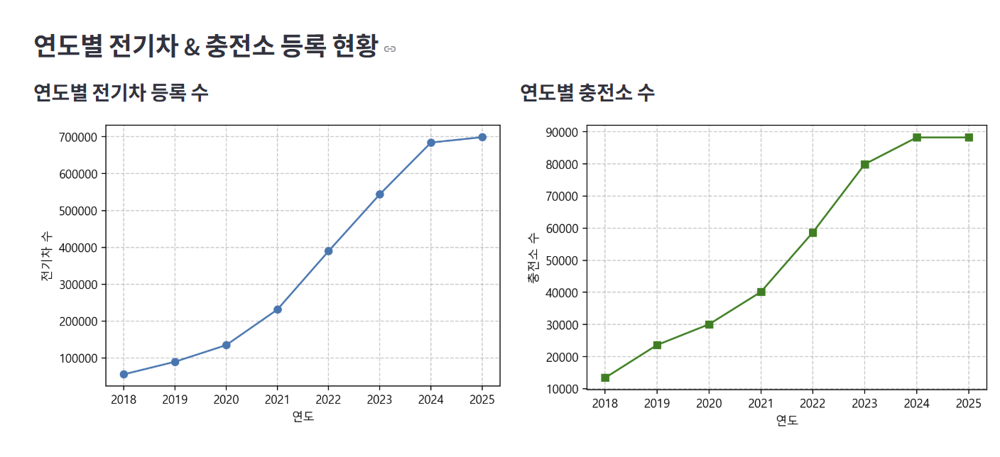

# SKN14-1TH-4TEAM

## 🕶️ 팀원소개

> SKN14-1TH-4TEAM: 내 이름은 코난, 탐정이조

> 김성민 · 문상희 · 안윤지 · 이나경 · 정민영


## 📅 개발 기간

2025.04.28 ~ 2025.04.29 (총 2일)

---

## 🏁 프로젝트 개요

### 💡 프로젝트명

> **EVision (이비전)→ EV(Electric Vehicle) + Vision(통찰, 지도에서 보는)
: 전기차 세상과 충전 인프라를 한눈에 볼 수 있다는 의미

### 📝 프로젝트 소개
- 전국 전기차 등록 현황과 충전소 등록 현황 및 보급률을 다양한 차트와 지도 기반으로 시각화하는 포털 서비스입니다.
- 사용자는 지역별 전기차 수와 충전소 수를 비교하고, 선택한 충전소의 상세정보 및 주변 편의시설, 인근 충전소 위치까지 확인할 수 있습니다.
- Streamlit 기반 웹 대시보드로 누구나 손쉽게 사용할 수 있도록 제작했습니다.

### 📌 필요성
- 전기차 수요 급증에 따라 충전 인프라 확충이 중요한 과제로 떠오르고 있습니다.
- 정부, 기업, 일반 사용자 모두 전기차와 충전소 현황을 쉽고 빠르게 확인할 수 있는 플랫폼의 필요성이 커졌습니다.

### 🎯 프로젝트 목표
- 전국 연도별 전기차 수 및 충전소 수 시각화
- 지역별 충전소 보급률(%) 분석
- 충전소 상세 정보 및 충전기 정보 조회
- 주변 편의시설 및 인근 충전소 위치 표시 기능 추가
- Streamlit을 활용한 반응형 인터페이스 구축

---

## 🛠️ 사용 기술

| 분류 | 기술 스택 |
|------|-----------|
| Language | Python |
| Framework/Library | Streamlit, Pandas, Plotly, Folium, BeautifulSoup |
| DB | MySQL |
| 협업 도구 | Git, GitHub, Discord |

---

## 🗂️ 프로젝트 구조

```
app/
├── home.py
│── charging_station_count.py
│── config.py
│── create_db_and_grant.py
│── db_utils.py
│── kakao_api.py
├── .env
├── pages/
│   ├── 01_EV_Status.py
│   └── 02_Charging_Station.py
docs/
│   ├── ev_cars.csv
│   └── EV_charging_station_info.csv   
├── requirements.txt
└── README.md

```
## 🗂️ 프로젝트 실행
```
streamlit run ./app/home/py
```

## 🗂️ 라이브러리 설치
```
pip install -r requirments.txt
```
---

## 🧱 ERD & DB 설계


### 🔗 ERD 다이어그램


### 📋 테이블 명세서 (수정본)

|        테이블명        |                                         주요 컬럼                                         | 설명 |
|:------------------:|:-------------------------------------------------------------------------------------:|:---:|
|      지역별_충전기       | id(pk), 충전소명(pk), 주소, 위도, 경도, 충전기상태코드(fk), <br/>이용제한, 급속충전량,충전기타입코드(fk), 지역구분상세코드(fk) | 충전소 및 충전기 기본 정보 |
| 충전기타입_charger_type |                                  충전기타입, 충전기타입코드(pk)                                   | 충전기 타입 매핑 정보 |
|  충전기_charger_stat  |                                  충전기상태, 충전기상태코드(pk)                                   | 충전소 상태 매핑 정보 |
|      지역_zcode      |                                     지역명, 지역코드(pk)                                     | 광역시도(시/도) 코드 매핑 정보 |
|     지역_zscode      |                             지역코드(fk), 지역구명, 지역구분상세코드(pk)                              | 시군구(구/군/시) 코드 매핑 정보 |
|


## 🧪 데이터 수집 및 전처리

- **출처**:  
  - 한국환경공단_전기자동차 충전소 정보 오픈API 데이터  
  - 한국환경공단_전기차 충전소 위치 및 운영정보 CSV 데이터  
  - 카카오맵 API (편의시설 및 위치 데이터)

- **수집 방법**:  
  - **충전소 상세 데이터**: 한국환경공단 오픈 API를 이용하여 수집  
  - **충전소 및 전기차 등록현황 데이터**: CSV 파일 활용  
  - **주변 편의시설 데이터**: 카카오맵 API를 통해 충전소 주변 카테고리별(카페, 음식점, 편의점 등) 편의시설 정보 수집

- **전처리 과정**:
  - 충전소명 기준 중복 제거 및 정제
  - 설치년도 기준 전기차 충전소 누적 개수 필터링
  - 급속/완속 충전기 구분 컬럼 추가
  - 지역명(시/도, 시/군/구) 통일 및 코드 매핑 처리
  - 충전소별 위도·경도 좌표값을 기반으로 위치 정확성 검증
  - 카카오맵 API를 활용하여 선택한 충전소의 위치를 지도에 마커로 매핑
  - 충전소 반경 내 주요 편의시설(카페, 음식점, 편의점 등)을 카테고리별로 지도에 함께 표시

---

## 🔥 추가 기능 요약

| 추가한 기능 | 설명 |
|:---|:---|
| 카카오맵 API 연결 | 선택한 충전소의 위도·경도를 이용해 지도에 충전소 표시 |
| 주변 편의시설 검색 | 반경 내 주요 편의시설 검색 및 지도에 표시 |
| 편의시설 카테고리 매핑 | 카페, 편의점, 음식점, 대형마트, 병원, 약국 등 카테고리별 색상 구분 표시 |

---

## ✏️ 데이터 흐름 예시

1. 사용자가 지역을 선택 → 충전소 리스트 제공
2. 특정 충전소 클릭 → 충전소 위치를 지도에 표시
3. 충전소 주변 편의시설(카페/편의점 등) 자동 탐색 → 지도에 함께 표시


---

## 📊 주요 기능 소개

### 1. 전기차 등록 및 충전소 현황 대시보드
- 연도별 전국 전기차 등록 수 시계열 그래프
- 연도별 전국 충전소 수 시계열 그래프
- 연도별 충전소 보급률(%) 분석
- 2025년 기준 지역별 전기차 수 및 충전소 수 지도/막대그래프
- 선택한 연도 기준 지역별 전기차 충전소 보급률 그래프

### 2. 충전소 상세조회 페이지
- 시/구/동별 충전소 검색 및 리스트 조회
- 선택한 충전소 상세정보(주소, 충전기 타입, 충전기 상태、이용자 제한사항 등) 제공
- 선택 충전소 인근 편의시설(카페, 식당 등) 및 주변 충전소를 지도에 표시

---

## 📌 WBS (Work Breakdown Structure)

|        작업명        |      담당자      |      산출물       |
|:-----------------:|:-------------:|:--------------:|
|    프로젝트 주제 선정     |     전체 팀원     |     주제 기획서     |
|   데이터 수집 및 전처리    |  김성민,안윤지,정민영  | CSV 파일, 오픈 API |
|     홈 페이지 개발      |      이나경      |  Streamlit 파일  |
| 페이지 1 (EV 현황) 개발  | 김성민, 안윤지, 정민영 |  Streamlit 파일  |
| 페이지 2 (충전소 조회) 개발 |      문상희      |  Streamlit 파일  |
|    최종 점검 및 배포     |     전체 팀원     |  발표 자료, 대시보드   |


## 📷 결과 시연 이미지

| 기능                 | 이미지                                                                      |
|--------------------|--------------------------------------------------------------------------|
| 전기차 및 충전소 현황 대시보드  |  |
| 충전소 상세정보 및 근처 편의시설 조회 페이지 | |

---

## 💬 한 줄 회고

| 이름 | 한 줄 회고 |
|------|---------|
| 김성민 | 처음 해보는 Streamlit 대시보드 개발이었지만, 데이터 시각화를 직접 구현해보며 자신감을 얻었습니다.|
| 문상희 | 충전소 및 지도 API 데이터를 Streamlit으로 연동하고, 충전소 조회 기능을 직접 구현하며 복합 기술을 연결하는 재미를 알게 되었습니다.|
| 안윤지 | 실제 데이터 수집과 전처리를 하며, 데이터 분석을 위해 정제된 데이터가 중요하다는 것을 알게되었습니다. 팀원들과 소통하며 프로젝트를 마무리하여 뿌듯합니다. |
| 정민영 | 데이터 수집부터 전처리, 시각화까지의 과정을 팀원들과 협업하며 수행하면서 협업의 중요성과 데이터 처리 역량을 함께 키울 수 있었습니다.|
| 이나경 | 홈 화면은 사용자가 앱이나 웹사이트에 처음 접했을 때 가장 많이 상호작용하게 되는 부분이기 때문에, 효율적이고 직관적인 디자인이 필요하다는 점을 많이 느꼈습니다. streamlit을 활용한 UI/UX를 구성해보며 사용자의 행동 흐름을 고려해보고 어떤 기능이 가장 중요한지, 어떻게 빠르게 접근할 수 있을지를 중심으로 고민해봤던 좋은 시간이었습니다.|

---
